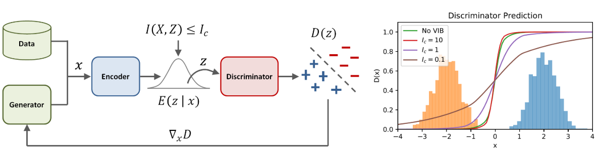

# Adversarial Imitaion Learning

## Imitaion Learning

- Learning to perform a task from expert's demonstrations without interaction with the expert or access to reinforcement signal
- Used when interacting with the environement is hard or impossible
- Behavior Cloning (BC), Inverse Reinforcement Learning (IRL) ...

## Generative Adversarial Imitaion Learning

### Background

For a given expert policy $\pi_E$, inverse reinforcement learning (with maximum causal entropy) is defined as follows:

$$
\underset{c\in C}{\max}\big(\underset{\pi\in\Pi}{\min}-H(\pi)+\mathbb{E}_\pi [c(s,a)]\big) - \mathbb{E}_{\pi_E}[c(s,a)], \\
$$

where $H(\pi) = \mathbb{E}_\pi [-\log \pi(a|s)]$ is the $\gamma$-discounted causal entropy of the policy $\pi$.

Normally, entropy regularizer term is maximized so that it could encourage the learner's exploration.

But later, we will propose the different approach instead minimizing the entorpy regularizer.

The inside bracket term is the RL problem, which finds the optimal policy in terms of minimizing the cost function $RL(c) = \arg \underset{\pi\in\Pi}{\min} - H(\pi) + \mathbb{E}_\pi[c(s,a)]$.

The outside term is the IRL problem, which finds the cost function that maximizes the difference in the policy between the agent and the expert.

### Characterizing the induced optimal policy

As explained earlier, IRL problem is equivalent to finding a cost function that causes the expert policy to incur a lower cost function than other policies.

$$
IRL_\psi = \arg \underset{c\in\mathbb{R}^{S\times A}}{\max} -\psi(c) + \big( \underset{\pi\in\Pi}{\min} - H(\pi) + \mathbb{E}_\pi [c(s,a)] \big) - \mathbb{E}_{\pi_E} [c(s,a)],
$$

where $\psi$ is a convex cost regularizer. What we are interested in is the policy obtained as a result of $R(\tilde{c})$, where $\tilde{c}$ is the result of IRL.

Define occupancy measure $\rho_\pi:\mathcal{S}\times\mathcal{A}\to\mathbb{R}$ as:

$$
\rho_\pi(s,a)=\pi(a|s)\sum_{t=1}^\infty \gamma^t P(s_t=s|\pi).
$$

Then, for cost function $c$, $\mathbb{E}_ {\pi} [c(s,a)]=\sum_{s,a}\rho_ {\pi}(s,a)c(s,a)$.

> Theorem. $RL\odot IRL_\psi (\pi_E) = \arg \underset{\pi\in\Pi}{\min} -H(\pi) + \psi^*(\rho_\pi - \rho_{\pi_E})$

Proof,

$$
\begin{align}
RL\odot IRL_\psi(\pi_E) &= \arg \underset{\pi\in\Pi}{\min} -H(\pi) + \mathbb{E}_\pi [c(s,a)] - \mathbb{E}_{\pi_E}[c(s,a)] - \psi(c) \\
&=\arg \underset{\pi\in\Pi}{\min} -H(\pi) + \sum_{s,a} \rho_\pi(s,a)c(s,a) - \sum_{s,a} \rho_{\pi_E} (s,a)c(s,a) - \psi(c) \\
&=\arg \underset{\pi\in\Pi}{\min} -H(\pi) + \sum_{s,a}(\rho_\pi(s,a) - \rho_{\pi_E}(s,a))c(s,a) - \psi(c) \\
&=\arg \underset{\pi\in\Pi}{\min} -H(\pi) + \psi^*(\rho_\pi - \rho_{\pi_E}), \\
\end{align}
$$

where the last equality is from the conjugate function $\psi^{\*}$ ( $f^{\*} (x)=\sum_ {y\in R^{\mathbb{S}\times\mathbb{A}}} x^{T} y - f(y)$ ). 

We can see that the problem is to minimize the occupancy measure between $\pi$ and $\pi_ E$ in terms of $\psi^*$.

> Lemma. If $\rho\in\mathbb{D}$, $\rho$ is the occupancy measure of $\pi_\rho(a|s)\triangleq \rho(s,a)/\sum_{a'}\rho(s,a')$, and $\pi_\rho$ is the only policy corresponding to occupancy measure $\rho$

> Lemma. Define $\tilde{H}(\rho) = -\sum_{s,a} \rho(s,a) \log(\rho(s,a)/ \sum_{a'} \rho(s,a')$. If $\forall \pi\in\Pi, \forall\rho\in\mathbb{D}$ $\tilde{H}(\rho)$ is strictly concave, $H(\pi)=\tilde{H}(\rho_\pi)$ and $\tilde{\rho} = H(\pi_\rho)$.

Using the above lemmas, the objective problem can be represented as follows:

$$
\underset{\rho\in\mathbb{D}}{\min} -H(\rho)\ \text{subject to}\ \rho(s,a)=\rho_E(s,a)\ \forall s\in\mathbb{S},a\in\mathbb{A}.
$$

Therefore, IRL can also be seen as a process that gets the occupancy measure of a policy that matches the expert's.

### Generative adversarial imitation learning

A new cost regularizer, which enables more accurate occupation measure matching and is also computationally valid in large environments, is defined as follows:

$$
\begin{align}
f(x) \triangleq \begin{cases} \mathbb{E}_{\pi_E} [g(c(s,a))] & \text{if } c<0 \\
                      +\infty                                    & \text{otherwise }     %
        \end{cases}
\text{where}\ g(x) = \begin{cases} -x-\log (1-e^x) & \text{if } x< 0 \\
                      +\infty                                    & \text{otherwise }      %
        \end{cases}
\end{align}
$$

In the above regularizer, if the cost function predicts a low cost for the expert state-action pair, it generates less penalty, and in the opposite situation, it generates a very large penalty.

In addition, since the average is taken for all expert trajectories, some adjustment to the arbitrary expert data sets will be possible.

Conjugate function $\psi_{GA}^*$ is defined as follows from the definition of Jensen-Shannon divergence $D_{JS}$:

$$
\psi_{GA}^* (\rho_\pi - \rho_{\pi_E}) = \underset{\mathbb{D}\in(0,1)^{\mathbb{S}\times\mathbb{A}}}{\max} \mathbb{E}_\pi [\log(D(s,a))] + \mathbb{E}_{\pi_{E}} [\log (1-D(s,a))].
$$

Finally, let's define an objective function:

$$
\underset{\pi}{\min} \psi_{GA}^* (\rho_\pi - \rho_{\pi_E}) - \lambda H(\pi) = D_{JS}(\rho_{\pi}, \rho_{\pi_E}) - \lambda H(\pi),
$$

which finds a policy whose occupancy measure minimizes Jensen-Shannon divergence to the experts.

Therefore, the authors changed RL-IRL problem into the form of a generative adversarial network training problem.

RL is trained with the model-free policy gradient (PG) algorithm and used Trust Region Policy Optimization (TRPO) algorithm.

### Generative adversarial imitation learning with observation alone

We will come back to this later, after introducing Forward Adversarial Imitaion Learning (FAIL) first.

## Variational Adversarial Imitaion Learning

### Variational Discriminator Bottleneck

Discriminator is prone to overpowering the generator leading to instability and poor performacne

Variational adversarial imitaion learning (VAIL) propose variational discriminator bottleneck (VDB) to constraint information flow to the discriminator

$$
J(D,E)=\underset{D,E}{\min}\underset{\beta\geq 0}{\max} \mathbb{E}_ {x\sim\pi^{\*}(x)}[\mathbb{E} {z\sim  E(Z|X)} [-\log(D(z))] + \mathbb{E}_ {x\sim \pi(x)} [\mathbb_ {z\sim E(Z|X)} [-\log (1-D(z))]] + \beta(\mathbb{E}_ {x\sim\tilde{\pi}(x)} [KL[E(z|x)||r(z)]] - I_ c)
$$

 

Left side of the figure shows the overview of the variational discrimnator bottleneck.

Right side of the figure is the visualization of discriminators trained to differentiated two Gaussians with different $KL$ bounds $I_ C$.

## Forward Adversarial Imitaion Learning

### Problem Setting

The general goal of reinforcement learning (RL) is to maximize the expected cost (or return) in finite timestep (finite horizon), where the agent tries to learn the optimal policy by interacting state and action information with the environment.

In the next paragraph, we will learn more about the terms.

#### Preliminaries

We consider an episodic finite horizon Decision Process that consists of $\{\mathcal{X}_ h\}_{h=1}^H,\ \mathcal{A},\ c$, $\ H,\ \rho,\ P$ where $\mathcal{X}_ h$ for $h\in[H]$ is a time-dependent $\mathcal{A}$ is a discrete action such space such that $|\mathcal{A}|=K$, $H$ is the horizon.

We assume the cost function $c:\mathcal{X}_H\to\mathbb{R}$ is only defined at the last time step $H$, and $\rho \in\Delta(\mathcal{X}_{h+1})$ for $h\in[H-1]$.

We assume that the cost function only depends on observations.

We assume that $\mathcal{X}_h$ is discrete. Also $|\mathcal{X}_h|$ could be easily extremely large and the algorithm that has a polynomial dependency on $|\mathcal{X}_h|$ should be considered as sample inefficient.

We assume that the cost is bounded for any sequence of observation, $c_H\leq 1$.

For a time-dependent policy $\pi:\{\pi_1,\dots,\pi_H\}$ with $\pi_{h} : \mathcal{X}_h\to\Delta(\mathcal{A})$, the value function $V_h^\pi:\mathcal{X}_h\to[0,1]$ is defined as:

$$
V_h^\pi(x_h)=\mathbb{E}[c(x_H)|a_i\sim\pi_i(\cdot|x_i),x_{i+1}\sim P_{x_i,a_i}],
$$

and state-action function $Q_h^\pi(x_h,a_h)$ is defined as $Q_h^\pi(x_h,a_h)=\mathbb{E}_{x_{h+1}\sim P_{x_h,a_h}}[V_{h+1}^\pi (x_{h+1})]$ with $V_H^\pi(x)=c(x)$.

We denote $\mu_h^\pi$ as the distribution over $\mathcal{X}_h$ at time step $h$ following $\pi$.

Given $H$ policy classes $\{\Pi_1,\dots, \Pi_H\}$, the goal is to learn a $\pi=\{\pi_1,\dots,\pi_H\}$ with $\pi_h\in\Pi_h$, which minimizes the expected cost:

$$
J(\pi)=\mathbb{E}[c(x_H)|a_h\sum \pi_h(\cdot|x_h),x_{h+1}\sim P(\cdot|x_h,a_h)].
$$

Denote $\mathcal{F}_h\subset \{f:\mathcal{X}_h\to\mathbb{R}\}$ for $h\in[H]$.

We define a Bellman Operator $\Gamma_h$ associated with the expert $\pi_h^*$ at time step $h$ as $\Gamma_h:\mathcal{F}_{h+1}\to \{ f: \mathcal{X}_h\to\mathbb{R}\}$ where for any $x_h\in\mathcal{X}_h$, $f\in\mathcal{F}_{h+1}$,

$$
(\Gamma_h f)(x_h) \triangleq \mathbb{E}_{a_h\sim\pi_h^* (\cdot|x_h),x_{h+1}\sim P_{x_h,a_h}}[f(x_{h+1})].
$$

#### Integral Probability Metrics (IPM) 

IPM is a family of distance measure on distributions: given two distributions $P_1$ and $P_2$ over $\mathcal{X}$, and a function class $\mathcal{F}$ containing real-value functions $F:\mathcal{X}\to\mathbb{R}$ and symmetric (e.g., $\forall f\in\mathcal{F}$, we have $-f\in\mathcal{F}$, IPM is defined as:

$$
\underset{f\in\mathcal{F}}{\sup} (\mathbb{E}_{x\sim P_1} [f(x)] - \mathbb{E}_{x\sim P_2} [f(x)]).
$$

We could obtain various popular distances by choosing the different classes of functions $\mathcal{F}$.

For instance IPM with $\mathcal{F}=\{f:||f||_\infty \leq 1\}$ recovers Total Variation distance, IPM with $\mathcal{F}=\{f:||f||_L \leq 1\}$ recovers Wasserstein distance, and IPM with $\mathcal{F}=\{f:||X||_{\mathcal{H}} \leq 1\}$ with RKHS $\mathcal{H}$ reveals maximum mean discrepancy (MMD), which is the implemented method for the paper.

